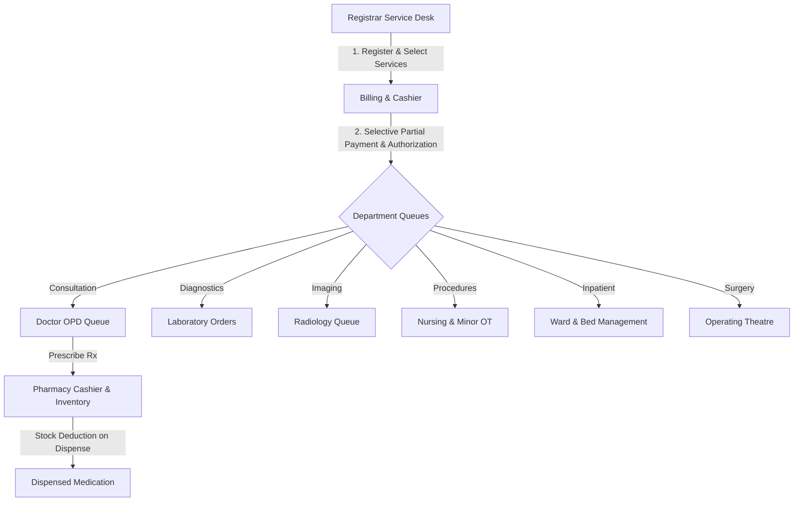

# Ethiopian Hospital Information & Management System (HIMS)
## Comprehensive Functional & Operational Reference Manual

---

## 1. Executive Summary & Architecture Overview

The **Hospital Management System (HIMS)** is a multi-departmental, role-based enterprise healthcare platform tailored to the clinical and operational standards of Ethiopian medical institutions.

### System Architecture
- **Backend**: Node.js & Express REST API with PostgreSQL 18+ relational database engine.
- **Frontend**: React 19 SPA (Single Page Application) with Vite, Tailwind-compatible modern CSS design tokens, and debounced live search.
- **Authentication**: Stateless JSON Web Tokens (JWT) with bcrypt salt rounds (10), multi-field identity verification for account recovery, and cryptographically secure password complexity enforcement.
- **Financial Standard**: Strict Ethiopian Birr (`ETB`) denomination across all charges, tariffs, cashier orders, invoices, and financial reports. No foreign currency symbols are used.
- **Database Baseline**: Clean state architecture supporting `0 Patients` and `0 Staff` on initial deployment with zero-record admin bootstrap.



---

## 2. User Roles & Access Control Matrix (RBAC)

The system enforces granular authorization at the backend route, controller, and database query levels.

| Role | Default Landing | Clinical Permissions | Financial & Order Permissions | Administrative Permissions |
| :--- | :--- | :--- | :--- | :--- |
| **ADMIN** | `/dashboard/admin` | Full read access across all clinical queues | Full pricing control, price history audit, financial reports | Staff creation, role assignment, system configuration, audit logs |
| **REGISTRAR** | `/registrar/desk` | Patient registration, search, visit check-in | Multi-service ordering, selective partial payment collection, cashier receipts | None |
| **DOCTOR** | `/doctor/queue` | Consultation encounters, diagnoses, vitals, order labs/radiology/procedures | Prescribe medications to Pharmacy Cashier, view patient balances | Manage own schedule |
| **NURSE** | `/nurse/triage` | Triage vitals (BP, HR, RR, Temp, SpO2), nursing notes, specimen collection | View triage charges | View department appointments |
| **PHARMACIST** | `/prescriptions` | View medication orders, verify dosing & contraindications | Pharmacy cashier payment, stock deduction on dispensing, inventory management | View formulary catalog |
| **LAB_TECH** | `/laboratory` | Collect specimen, process analyzer runs, enter test findings, verify TAT | View laboratory payment authorization badge (`PAID` / `WAITING_PAYMENT`) | Manage test catalog & reference ranges |
| **RADIOLOGIST**| `/radiology/queue`| Perform X-Ray, Ultrasound, CT; enter radiological impressions & findings | View radiology payment authorization | None |
| **SURGEON** | `/surgery/queue` | Pre-op assessment, operative note documentation, post-op recovery notes | View surgical procedure authorization | None |
| **WARD_STAFF** | `/ward/inpatient`| Inpatient bed assignment, daily ward rounds, discharge summaries | View bed daily rate charges | Manage ward bed occupancy |
| **FINANCE** | `/billing` | View patient accounts and invoices | Global cashier, payment reversal, tax invoices, revenue reports | View chargemaster price history |

---

## 3. Step-by-Step Workflow Guides for Every Role

### 3.1 Initial Setup / Fresh System Administrator Initialization
1. When navigating to `/login` on a clean deployment (`0 staff accounts`), the portal detects uninitialized state.
2. Click **"Initialize System Administrator Account"**.
3. Complete the form: First Name, Last Name, Email, Ethiopian Phone (`09...`), Username (`admin`), and a strong Password.
4. The live password strength meter enforces:
   - Minimum 8 characters
   - At least 1 uppercase letter (`A-Z`)
   - At least 1 lowercase letter (`a-z`)
   - At least 1 numerical digit (`0-9`)
   - At least 1 special character (`!@#$%^&*...`)
5. Click **"Create Admin Account"** to bootstrap the hospital management database.

---

### 3.2 Administrator Workflows

#### Creating Staff Accounts
1. Navigate to **Administration → Staff & Role Management** (`/admin/staff`).
2. Fill out the **Create New Staff Account** form:
   - Name, Email, Ethiopian Phone format (`09XXXXXXXX` or `+2519XXXXXXXX`).
   - Select System Role (`REGISTRAR`, `DOCTOR`, `NURSE`, `PHARMACIST`, `LAB_TECH`, `RADIOLOGIST`, `SURGEON`, `WARD_STAFF`, `FINANCE`).
   - Specify Department and Specialty.
   - Enter Temporary Password meeting institutional security complexity.
3. Click **"Create Staff Member"**.

#### Managing Service Pricing & Chargemaster
1. Navigate to **Administration → Service Pricing** (`/admin/pricing`).
2. Search services live by name or code (e.g. `CBC`, `X-Ray`, `Bed`).
3. Click **"Edit Price"** on any billable service.
4. Input the new price in **Ethiopian Birr (ETB)** and click **"Save New Price (ETB)"**.
5. Click **"📜 History"** to inspect the immutable historical price log showing previous price, new price, modification timestamp, and admin staff username.

---

### 3.3 Registrar & Reception Workflows

#### Registering a Patient with Age Input
1. Navigate to **Registrar Service Desk** (`/registrar/desk`) or **Patients → Register Patient** (`/patients/new`).
2. Enter First Name, Last Name, Gender, Ethiopian Phone Number (`09...`), Address, and **Age in Years** (e.g. `32`).
3. The system automatically derives and records the date of birth (`DOB`) while displaying calculated age throughout all clinical queues.
4. Click **"Save Patient Record"** to generate a unique `PAT-YYYYMM-XXXX` identifier.

#### Service-First Multi-Service Visit Check-In
1. In **Registrar Service Desk** (`/registrar/desk`), search the patient live by name, phone, or `PAT-` ID.
2. Under **Hospital Service Catalog**, select one or multiple requested services:
   - `[✓] General Doctor Consultation (200.00 ETB)`
   - `[✓] Complete Blood Count (CBC) (300.00 ETB)`
   - `[✓] Chest X-Ray (450.00 ETB)`
3. Select Payment Method (`CASH`, `TELEBIRR`, `CBE_BIRR`, `BANK`, `CARD`, `INSURANCE`).
4. Click **"Create Visit & Process Payment"**.
5. The system authorizes selected services, issues invoice/receipt, and routes the patient directly to the respective department queues.

#### Selective / Partial Payment Collection (Cashier)
1. On the **Doctor Orders Cashier** tab or **Invoices & Cashier** (`/billing`), select the patient invoice or pending doctor order set.
2. The cashier drawer lists itemized service lines with individual checkboxes:
   - `[✓] Complete Blood Count — 300.00 ETB`
   - `[ ] Chest X-Ray — 700.00 ETB`
3. The cashier can check/uncheck lines based on patient funds:
   - Selected Total Due, Previously Paid Amount, and Remaining Balance calculate dynamically.
   - Price fields are read-only to prevent unauthorized tariff alteration.
4. Select Payment Method and click **"Authorize Selected Services"**.
5. The database sets the selected services to `PAID`, enqueues only them into diagnostic queues, and marks the parent invoice as `PARTIALLY_PAID`.

---

### 3.4 Doctor Clinical Consultation & Ordering

1. Navigate to **Consultation Queue** (`/doctor/queue`).
2. Click **"Start Encounter"** for the authorized patient.
3. Review Triage Vitals (BP, Pulse, Temp, SpO2, Respiratory Rate, Pain Score).
4. Document Subjective Chief Complaint, Objective Examination Findings, and Assessment/Diagnoses (with ICD codes).
5. **Ordering Hospital Diagnostics & Procedures**:
   - Select tests from Laboratory, Radiology, or Nursing Procedure catalogs.
   - Orders immediately appear at the **Registrar Cashier** for payment authorization.
6. **Prescribing Medications**:
   - Select drug from hospital formulary, specify dosage, frequency, route, and duration.
   - Medicine orders route directly to **Pharmacy Cashier & Dispensing**, bypassing general registrar.
7. Click **"Save & Finalize Encounter"**.

---

### 3.5 Laboratory Diagnostics & Real Turnaround Time (TAT) Tracking

1. Navigate to **Laboratory Orders Queue** (`/laboratory`).
2. Orders appear with priority (`ROUTINE`, `URGENT`, `STAT`) and payment authorization badge.
3. **Phase 1: Specimen Collection**:
   - Click **"Collect Specimen"** upon drawing blood/specimen. System records `sample_collected_at = NOW()`.
4. **Phase 2: Analyzer Processing**:
   - Click **"Start Processing"** when loaded into analyzer. System records `processing_started_at = NOW()`.
5. **Phase 3: Results Entry**:
   - Click **"Enter Result"**, record finding (e.g. `14.2 g/dL`), reference range, and abnormality flag.
   - System records `result_completed_at = NOW()` and calculates exact elapsed Turnaround Time in seconds and human-readable format (e.g., `32 minutes`, `1 hour 15 minutes`).
6. **Phase 4: Verification & Release**:
   - Click **"✓ Verify & Release"** to lock report and make findings visible to physician.
7. Click **"🖨️ Report"** to print official diagnostic sheet.

---

### 3.6 Pharmacy Dispensing & Real Stock Deduction

1. Navigate to **Prescriptions Queue** (`/prescriptions`).
2. Search patient prescription.
3. **Phase 1: Pharmacy Payment**:
   - Collect medication payment via Telebirr, Cash, or CBE Birr.
4. **Phase 2: Dispensing & Stock Accounting**:
   - Click **"Dispense Prescription"**.
   - The backend validates: `current_stock >= requested_quantity`.
   - If stock is insufficient, dispensing is blocked with `INSUFFICIENT_STOCK` error.
   - Upon confirmation, stock decreases by the exact dispensed quantity in a database transaction and creates an immutable entry in `inventory_transactions`.
5. **Phase 3: Stock Control & Low Stock Alerts (< 15 Units)**:
   - Navigate to **Pharmacy Inventory** (`/pharmacy/inventory`).
   - Click **"⚠️ Low Stock Alerts (< 15 Units)"** to inspect drugs with stock 14 or below (15 is normal).
   - Click **"📜 Stock Movement Transactions"** to audit all historical dispensations and restocks.

---

### 3.7 Radiology, Nursing Procedures, Inpatient Ward & Surgery

- **Radiology (`/radiology/queue`)**: Radiologist views authorized imaging requests, performs X-Ray/Ultrasound, uploads imaging impression, and releases final diagnostic report.
- **Nursing & Procedures (`/procedures/queue`)**: Nurses administer wound dressings, IV cannulation, catheterization, and injections with procedure outcome notes.
- **Inpatient Ward (`/ward/inpatient`)**: Ward nurses and physicians admit patients, assign beds (General, Semi-Private, ICU), record daily progress notes, and execute discharge summaries.
- **Operating Theatre (`/surgery/queue`)**: Surgeons schedule operations, log pre-op checklists, document operative surgeon notes, and transfer patients to recovery ward.

---

## 4. Key Business Rules & System Behaviors

1. **Clean Production Database Baseline**:
   - Initial deployment has `0 patients` and `0 staff members`.
   - Master data includes 9 canonical departments, 19 standard hospital services, 24 formulary medications, 6 ward beds, and 10 role definitions.
2. **Selective / Partial Payments**:
   - Registrars can select a subset of unpaid services.
   - Only selected services transition to `PAID` and enter clinical department queues.
   - Unselected items remain `WAITING_PAYMENT` without holding up paid care.
   - Prices and balances are strictly calculated by the backend database.
3. **Pharmacy Order Routing & Inventory Accounting**:
   - Clinical doctor service orders go to **Registrar Cashier**.
   - Medicine prescriptions go directly to **Pharmacy Cashier**.
   - Stock decreases **only** upon actual confirmed dispensing.
   - Low stock threshold is strictly **`< 15 units`** (14 or below triggers alert, 15 is normal).
4. **Real Laboratory Turnaround Time (TAT)**:
   - Tracks actual elapsed duration between specimen collection and result completion.
   - Expressed in human-readable units (`< 1 minute`, `X minutes`, `X hours Y minutes`).
5. **Department-Scoped Payment Authorization**:
   - Each clinical station only views payment authorization relevant to its department.
6. **Multi-Field Forgot Password Verification**:
   - Password reset requires exact verification of all 5 parameters: `Username`, `Last Name`, `Email`, `Phone`, and `Department`.
   - Failed attempts yield a generic failure message to prevent identity enumeration.
7. **Global Ethiopian Birr Currency**:
   - All currency values formatted as `ETB X,XXX.XX`. No foreign currency symbols.

---

## 5. API Reference & Data Models

### Authentication Endpoints
- `GET /api/auth/status` — Returns `{ isInitialized: boolean, staffCount: number }`.
- `POST /api/auth/setup-admin` — Bootstraps initial System Administrator (available only when staff count === 0).
- `POST /api/auth/login` — Authenticates staff credentials and issues JWT token.
- `POST /api/auth/forgot-password` — Validates 5 identity fields and returns one-time reset token.
- `POST /api/auth/reset-password` — Resets password with one-time token and strong password policy.

### Patient & Visit Endpoints
- `GET /api/patients?search=...` — Live search patients by name, phone, or `PAT-` number.
- `POST /api/patients` — Registers patient with `age` and derives `date_of_birth`.
- `POST /api/visits` — Creates new hospital visit.
- `POST /api/service-orders` — Orders billable services and generates invoice lines.

### Billing & Cashier Endpoints
- `GET /api/billing/pending-orders` — Retrieves pending unpaid doctor service orders for cashier desk.
- `POST /api/billing/payments/selective` — Processes itemized partial payments for selected service order IDs.
- `POST /api/billing/payments/:id/reverse` — Reverses payment and re-opens balances (Admin / Finance).

### Pharmacy & Inventory Endpoints
- `GET /api/pharmacy/medications?lowStock=true` — Retrieves formulary drugs with stock `< 15`.
- `POST /api/pharmacy/prescriptions` — Creates medication prescription.
- `POST /api/pharmacy/prescriptions/:id/dispense` — Dispenses prescription, decrements inventory, and logs transaction.
- `GET /api/pharmacy/inventory-transactions` — Retrieves inventory stock movement audit logs.

### Laboratory Endpoints
- `GET /api/laboratory/orders` — Retrieves lab queue with department payment authorization status.
- `POST /api/laboratory/orders/:id/collect` — Records specimen collection timestamp.
- `POST /api/laboratory/orders/:id/process` — Records analyzer start timestamp.
- `POST /api/laboratory/orders/:id/results` — Records test finding and calculates actual turnaround time.
- `POST /api/laboratory/orders/:id/verify` — Releases verified lab report to physician.

---

## 6. Acceptance Testing & Verification Guide

All core workflows have been validated via automated integration test suite (`backend/test/acceptance-all-requirements.test.js`):

```bash
# Run comprehensive acceptance test suite
cd backend
node --test test/acceptance-all-requirements.test.js
```

### Verification Checklist & Results:
- [x] **Test 1**: Admin Bootstrap & Strong Password Validation — **PASSED**
- [x] **Test 2**: Complete Patient Registration with Age Input — **PASSED**
- [x] **Test 3**: Bidirectional Doctor Availability Scheduling — **PASSED**
- [x] **Test 4**: Multi-Service Visit Check-In at Registrar Desk — **PASSED**
- [x] **Test 5**: Selective / Partial Cashier Payment & Department Enqueueing — **PASSED**
- [x] **Test 6**: Admin Service Price Management & Price History Audit — **PASSED**
- [x] **Test 7**: Real Laboratory Turnaround Time (TAT) Tracking — **PASSED**
- [x] **Test 8**: Pharmacy Stock Deduction Strictly on Dispense — **PASSED**
- [x] **Test 9**: Insufficient Stock Prevention & Low Stock Threshold (< 15) — **PASSED**
- [x] **Test 10**: Department-Scoped Payment Authorization Visibility — **PASSED**
- [x] **Test 11**: Multi-Field Secure Identity Verification Forgot Password — **PASSED**

---

## 7. Troubleshooting & FAQ

**Q: What should I do on initial startup when no staff exists?**
> A: Navigate to `/login`. The system detects zero accounts and presents the "Initialize System Administrator" modal. Create the admin user, and then proceed to `/admin/staff` to add medical personnel.

**Q: Why doesn't a doctor's prescribed medication appear on the Registrar's cashier desk?**
> A: Prescriptions route directly to **Pharmacy → Prescriptions & Cashier** (`/prescriptions`) so that clinical medication dispensing and pharmaceutical payments are managed by the pharmacy.

**Q: Can a registrar edit service prices during cashier checkout?**
> A: No. Service prices are centrally controlled by hospital administrators in **Administration → Service Pricing** (`/admin/pricing`). Cashiers can only select which services to pay for.

**Q: How does the system handle low medication stock?**
> A: Stock quantities strictly below 15 units (`14 or lower`) trigger low stock alerts in the **Pharmacy Inventory** dashboard. Items with 15 units or above are classified as normal.
